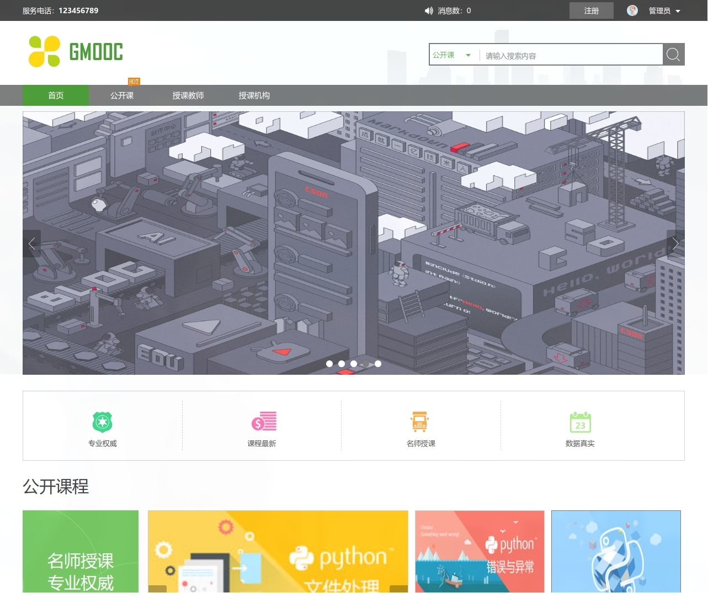
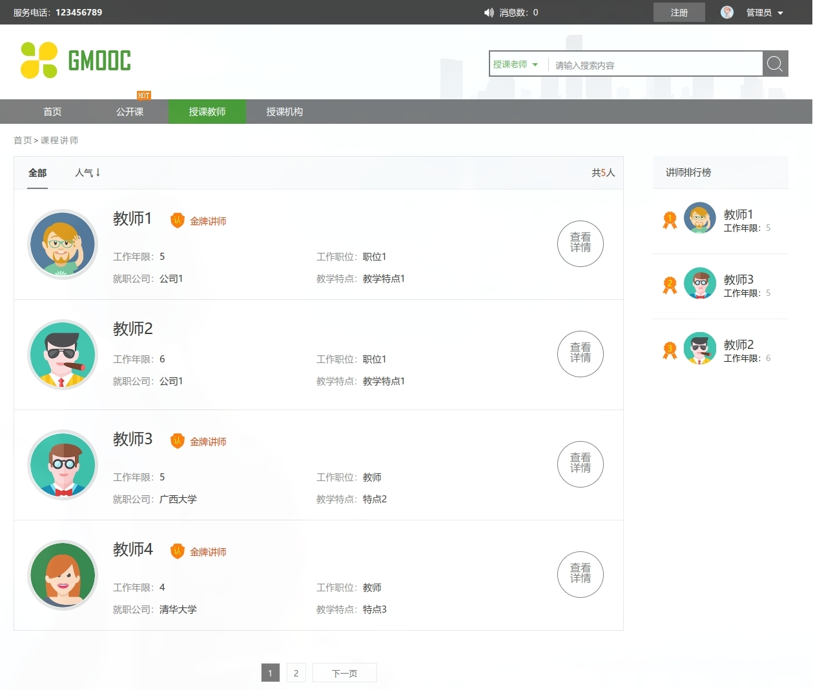
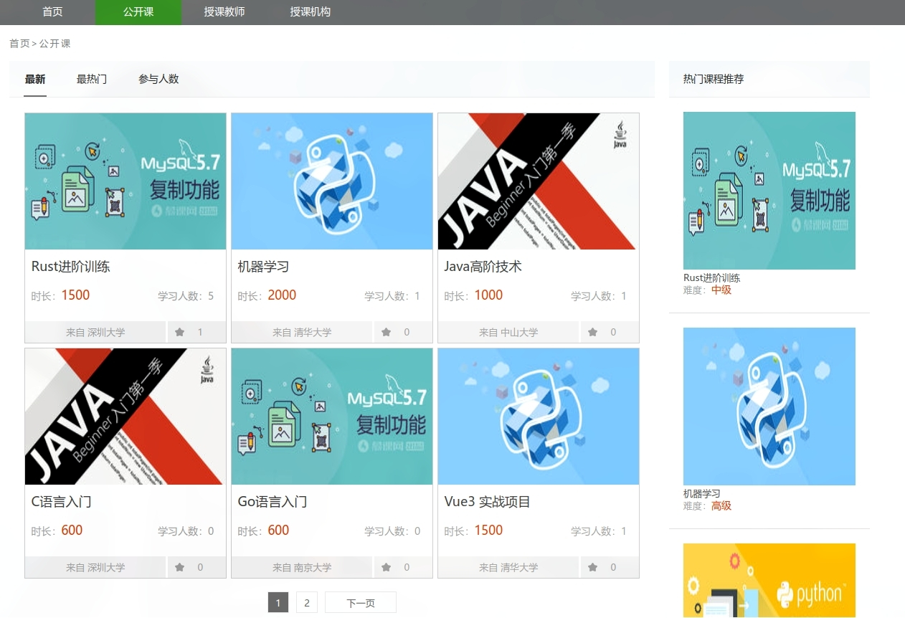

# mooc example
慕课在线学习平台，使用Django作为后端  

## Dependencies 依赖
可使用`pip install -r requirements.txt`直接安装依赖
* Django
* django-simpleui==2023.8.28
* django-pure-pagination
* django-simple-captcha
* django-import-export
* pymysql
* mysqlclient
* uwsgi

## Deploy 部署
1. **在安装好依赖后运行：**`python ./manage.py collectstatic`将admin所需的静态文件复制到`static`文件夹下
   
   > 在配置文件中`DEBUG`默认为`False`  
   > 如果你只是在开发环境中使用，可以设置为`True`并配置`STATICFILES_DIRS`，移除`STATIC_ROOT`  
   > Django会根据`STATICFILES_DIRS`自动查找静态文件的路径
   
2. 配置数据库：
   ```bash
   python ./manage.py makemigrations
   python ./manage.py migrate
   ```
   
3. 设置管理员账户密码：`python ./manage.py createsuperuser` 根据提示操作即可  
   
## Tips 提示
1. 在Django 3.2.15 下运行测试  
2. 管理员界面使用了[simpleui](https://github.com/newpanjing/simpleui)  
3. javascript组件使用了jQuery, [laydate](https://github.com/layui/laydate)等，大部分js，css代码来源于[该课程学习文件](https://coding.imooc.com/class/78.html)的老版本，本仓库重写了一定代码逻辑
4. 图片等媒体静态文件均来源于网络资料，原作者享有对应版权  


## Show 部分展示效果

  
  
  
  
